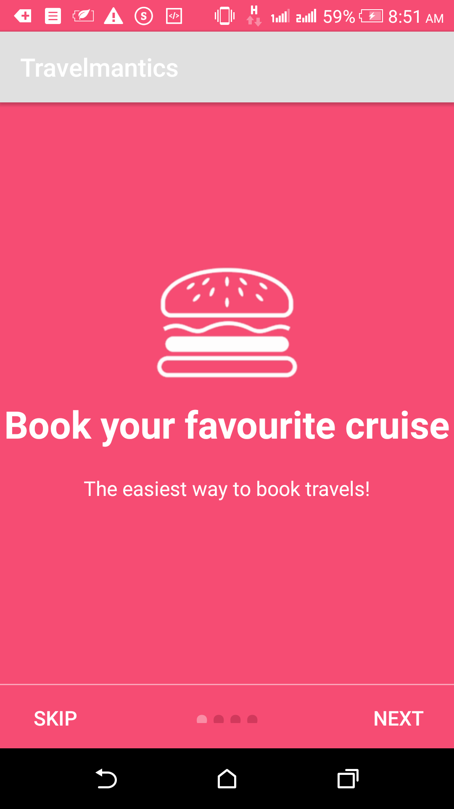
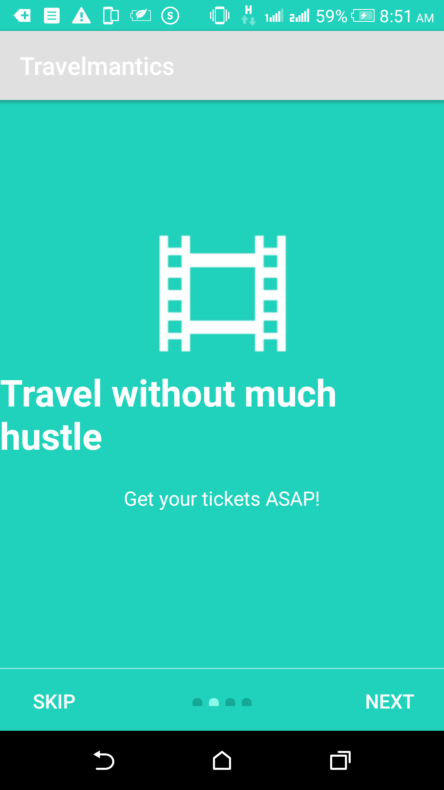
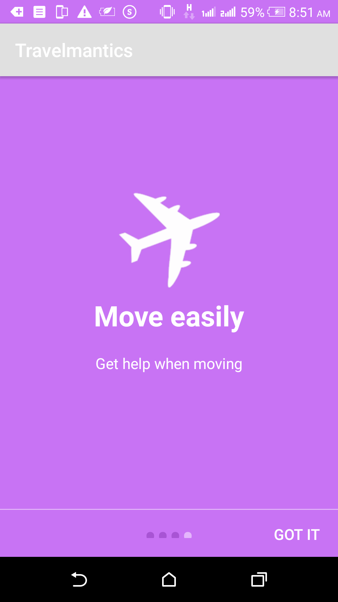
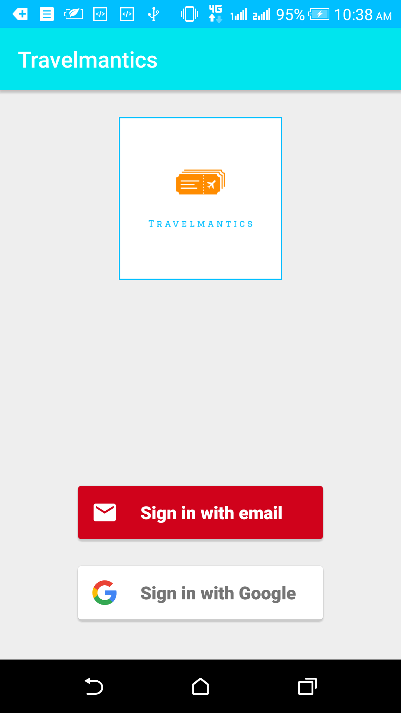
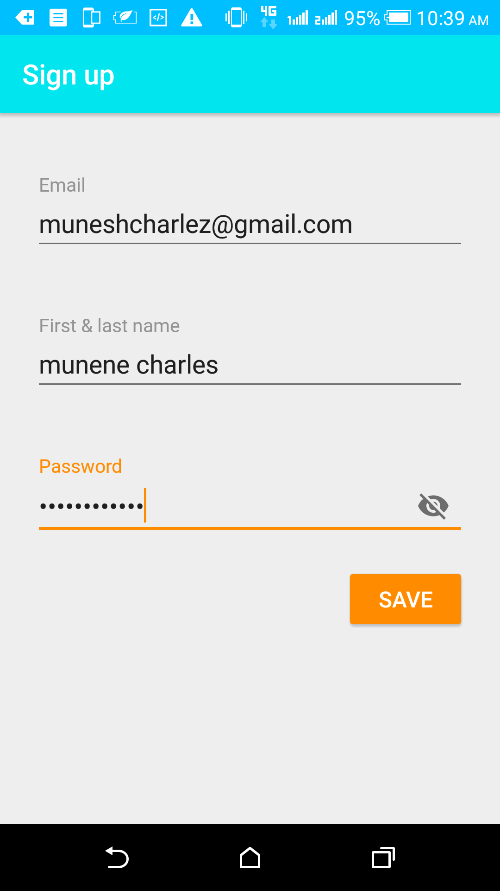

# Andela learning community 4.0 challenge
My Andela Learning Community 4.0 Android  Assessment Travelmantics Challenge 
# Prerequisites

You will need the following to run this project:

  1.A laptop or desktop machine with internet access
 2.Android Studio 3.0 Preview or later
# Setting Up

    Clone the Repository from Github
    Open the project folder using Android Studio IDE

# Splash Screen

The user will be presented with a splash screen first time they use the app. This helps them understand how the app is supposed to work using visual aids.

   
# Login Page
The user proceeds to the Login Page, where they need to authenticate by using either Google or email.
  
# Creating and viewing deals
The use can then view travel deals or create a deal if they are an administrator
   
